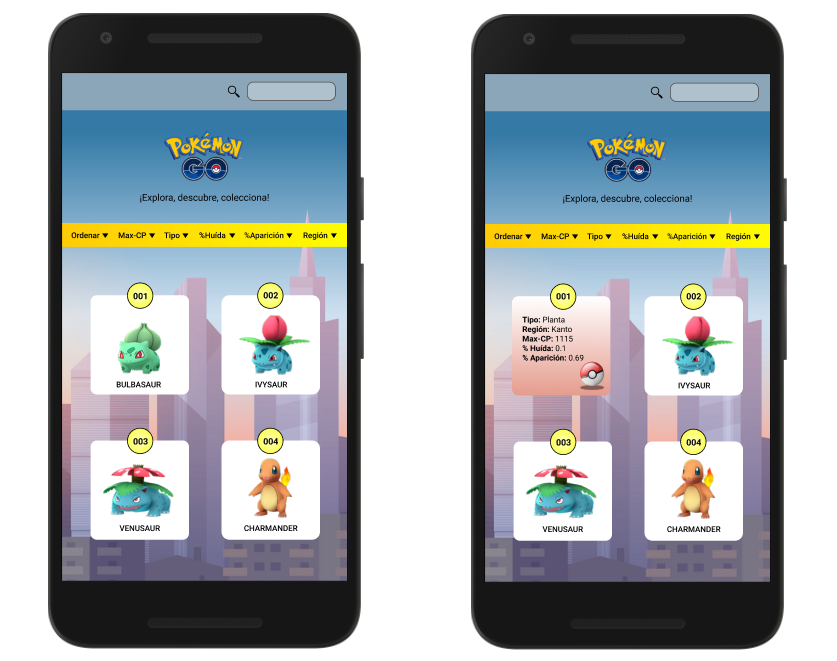
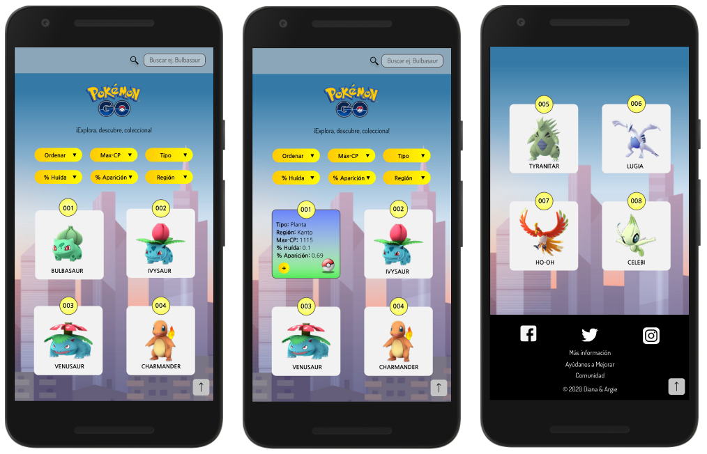
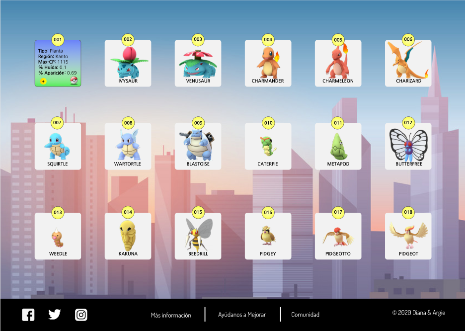
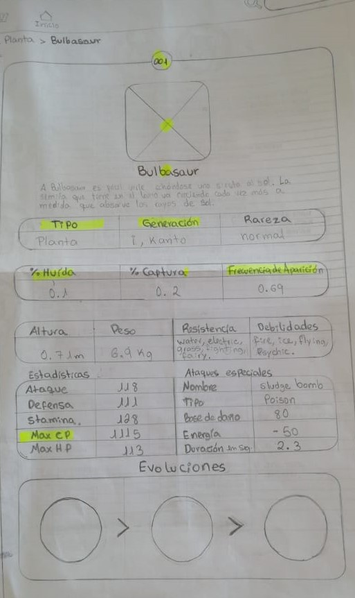
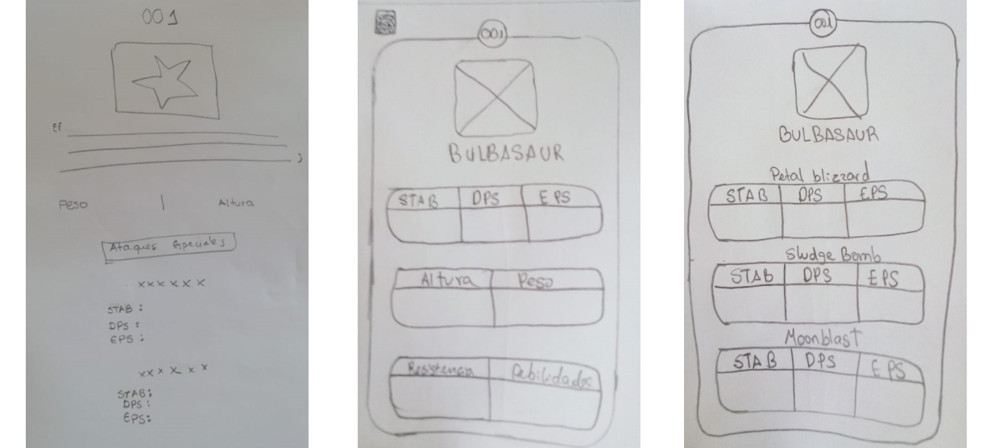
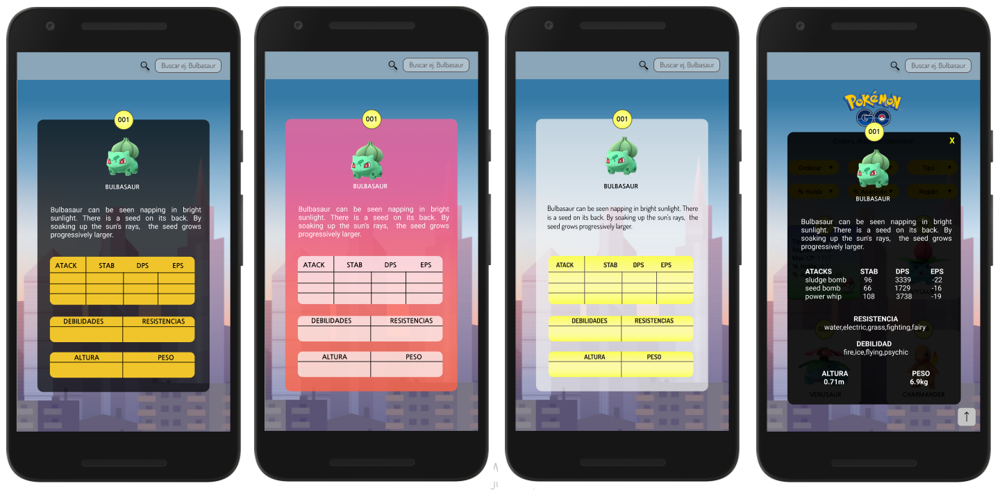
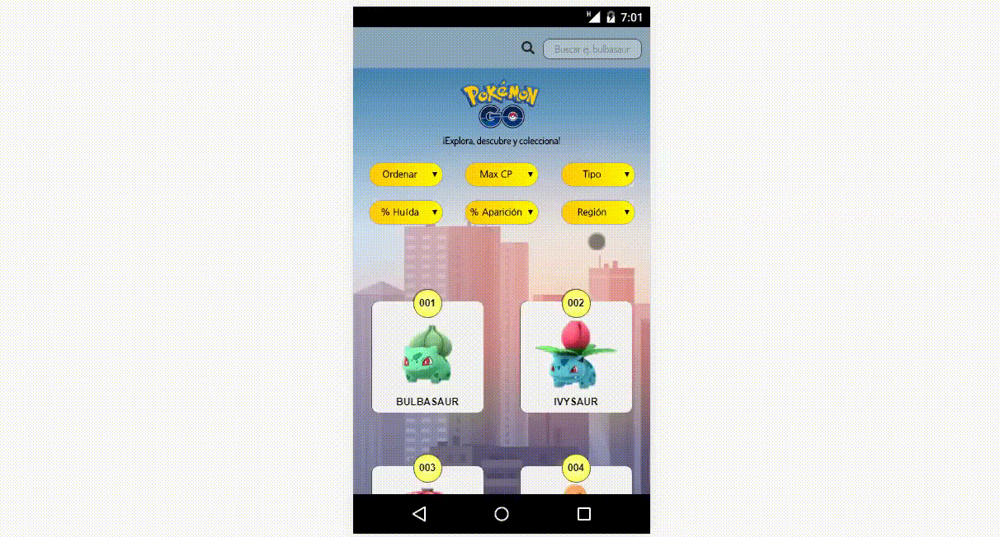

## NUEVA POKÉDEX

Se trata de una web en la que los Jugadores de Pokémon GO podrán familiarizarse mejor con los pokémons de la primera y segunda generación.

Para éste proyecto hemos considerado trabajar con dos tipos de usuarios:
- En primer lugar nos enfocamos en jugadores principiantes que buscan coleccionar el mayor numero de pokémons en el juego,
- y luego en jugadores experimentados que tienen como objetivo combatir con otros entrenadores y ganar gimnasios.

### Proceso de Diseño

Una vez definidos los usuarios con los que ibamos a trabajar desglozamos una a una sus necesidades en un total [9 historias de usuario](https://trello.com/b/d4r6cbB8/data-lovers).

**Nuestro primer prototipo de baja fidelidad fue diseñado de la siguiente manera:**

En un inicio nuestra idea era mostrarle al usuario una pantalla principal en la que se le visualizara una serie de tarjetas con iconos que hicieran referencia a las categorías mas top para los jugadores, y los filtros y pociones para o rdenar se iban a mostrar en un desplegable con un ícono de embudo al que podían acceder solo al hacerle click.
Testeamos éste primer prototipo con al menos 2 usuarios y al asignarles tareas notamos que se trabaron al momento de querer ordenar o aplicar los filtros a los pokémon es así que tuvimos que replantearnos la pantalla que se iba a mostrar al momento de ingresar a la web y creamos nuestro segundo prototipo de baja fidelidad.

Enfocándonos un poco más en nuestra 1era historia de usuario (Mostrar a los Pokémons ordenados por número de pokédex)  cambiamos la vista de la pantalla inicial de la web.
Luego empezamos a trabajar en los prototipos de alta fidelidad de las demás historias de usuario, quedando así:

Lo testeamos nuevamente con 1 usuario y nos hizo notar que la barra donde mostrábamos los filtros estaba muy ajustada y no era muy comodo a la vista ni mucho menos al intentar acceder a alguna opción con el dedo, ya que podía escoger otra por error. Así que rediseñamos el área de los filtros de la siguiente manera:

 De barra con desplegables cambiamos a "botones", testeamos nuevamente con al menos 2 usuarios éste prototipo y resultó ser más intutitivo que el anterior, y luego pasamos a diseñarlo en versión Desktop.

Luego de trabajar con las primeras 8 historias que priorizamos, creamos una que consideramos que nos había faltado para completar el proyecto:

**COMO** jugador con experiencia  
**QUIERO** visualizar el STAB, DPS, EPS de los ataques especiales  
**PARA** saber que ataque escoger al momento de combatir por un Gimnasio.

Trabajamos en varios prototipos de baja fidelidad para poder llegar al término de ésta historia, ya que no solo queríamos dejarle visible al usuario los ataques y sus respectivas bonificaciones sino también información que le podía resultar relevante como los tipos a los que es vulnerable un Pokémon y a los que es resistente.

Incluso también estabamos considerando mostrar las evoluciones de los pokémon, pero notamos que ésto se desviaba un poco del objetivo de nuestra historia de usiario, así que lo simplificamos para centrarnos en la bonificacion de los ataques.

Entre tantas ideas de mostrar ésta información procedimos a hacer varios diseños en alta fidelidad para escoger el más sencillo en intuitivo para nuestros usuarios:

Consultamos a varios usuarios cuál le resultaba más fácil de entender y visualizar al momento de buscar éstos datos y se decidió usar el prototipo más simple con fondo negro.

[Aquí](https://www.figma.com/file/wHKJrtfoKdeg3MppD8o1rK/POKEMON-GO?node-id=0%3A1) podrán acceder a nuestro prototipo de alta fidelidad en Figma.

Y con ésta HU damos por terminado nuestro proyecto DATA LOVERS - Nueva Pokédex.

Quedando así:

## Versión Desktop

## Versión Mobile

Les invitamos a que visiten nuestra web, y si tienen alguna sugerencia llenar nuestra encuesta de **Ayudanos a mejorar!**  ubicada en la sección del pie de página. :)

## 9. Checklist del Proyecto

* [x] Usa VanillaJS.
* [x] No hace uso de `this`.
* [x] Pasa linter (`npm run pretest`)
* [x] Pasa tests (`npm test`)
* [x] Pruebas unitarias cubren un mínimo del 70% de statements, functions y
  lines y branches.
* [x] Incluye _Definición del producto_ clara e informativa en `README.md`.
* [x] Incluye historias de usuario en `README.md`.
* [x] Incluye _sketch_ de la solución (prototipo de baja fidelidad) en
  `README.md`.
* [x] Incluye _Diseño de la Interfaz de Usuario_ (prototipo de alta fidelidad)
  en `README.md`.
* [x] Incluye link a Figma en `README.md`.
* [ ] Incluye el listado de problemas que detectaste a través de tests de
  usabilidad en el `README.md`.
* [x] UI: Muestra lista y/o tabla con datos y/o indicadores.
* [x] UI: Permite ordenar data por uno o más campos (asc y desc).
* [x] UI: Permite filtrar data en base a una condición.
* [x] UI: Es _responsive_.

## 10. OBJETIVOS DE APRENDIZAJE

### UX

- [x] Diseñar la aplicación pensando y entendiendo al usuario.
- [x] Crear prototipos para obtener _feedback_ e iterar.
- [x] Aplicar los principios de diseño visual (contraste, alineación, jerarquía).
- [x] Planear y ejecutar _tests_ de usabilidad.

### HTML y CSS

- [x] Entender y reconocer por qué es importante el HTML semántico.
- [x] Identificar y entender tipos de selectores en CSS.
- [ ] Entender como funciona `flexbox` en CSS.
- [x] Construir tu aplicación respetando el diseño planeado (maquetación).

### DOM

- [x] Entender y reconocer los selectores del DOM (`querySelector` | `querySelectorAll`).
- [x] Manejar eventos del DOM. (`addEventListener`)
- [x] Manipular dinámicamente el DOM. (`createElement`, `appendchild`, `innerHTML`, `value`)

### Javascript

- [x] Manipular arrays (`filter` | `map` | `sort` | `reduce`).
- [x] Manipular objects (key | value).
- [x] Entender el uso de condicionales (`if-else` | `switch`).
- [x] Entender el uso de bucles (`for` | `forEach`).
- [ ] Entender la diferencia entre expression y statements.
- [x] Utilizar funciones (`parámetros` | `argumentos` | `valor de retorno`).
- [x] Entender la diferencia entre tipos de datos atómicos y estructurados.
- [x] Utilizar ES Modules (`import` | `export`).

### Pruebas Unitarias (_testing_)
- [x] Testear funciones (funciones puras).

### Git y GitHub
- [x] Ejecutar comandos de git (`add` | `commit` | `pull` | `status` | `push`).
- [x] Utilizar los repositorios de GitHub (`clone` | `fork` | `gh-pages`).
- [x] Colaborar en Github (`pull requests`).

### Buenas prácticas de desarrollo
- [ ] Organizar y dividir el código en módulos (Modularización).
- [x] Utilizar identificadores descriptivos (Nomenclatura | Semántica).
- [x] Utilizar linter para seguir buenas prácticas (ESLINT).
